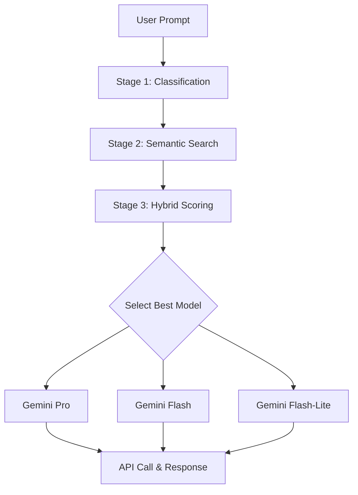

# 🧠 LLM Dynamic Router

An intelligent, multi-stage routing application that dynamically selects the most optimal Gemini language model (Pro, Flash, or Flash-Lite) for a given user prompt. This project demonstrates a sophisticated pipeline to reduce costs, decrease latency, and improve response accuracy by matching prompt complexity to model capability.

[](https://www.python.org/downloads/)
[](https://streamlit.io/)
[](LICENSE)

## 🚩 The Problem: One Size Doesn't Fit All

In the world of Large Language Models, using a single model for all tasks is highly inefficient:

- **Using only a powerful model** (like GPT-4o or Gemini 2.5 Pro): Incurs high costs and latency for simple tasks like basic chat or extraction, where a smaller model would suffice.

- **Using only a lightweight model** (like Gemini 2.5 Flash-Lite): Fails to deliver the required quality and reasoning for complex tasks like advanced code generation or in-depth analysis.

A static approach leads to a trade-off between cost and quality. **A dynamic router eliminates this trade-off.**

## ✨ Our Solution: A Multi-Stage Intelligent Pipeline

This project implements a sequential, funnel-like architecture to analyze a user's prompt and route it to the best-suited model. Each stage refines the decision-making process.

### Stage 1: Prompt Classification (The "What")

We use the powerful **NVIDIA Prompt Task and Complexity Classifier**.

- [https://huggingface.co/nvidia/prompt-task-and-complexity-classifier](https://huggingface.co/nvidia/prompt-task-and-complexity-classifier)
- This model analyzes the user's prompt and determines its fundamental intent (e.g., Code Generation, Summarization, Reasoning) and complexity dimensions.

### Stage 2: Filtered Semantic Search (The "Who")

Using the task type from the classifier, we perform a **similarity search** against a curated database of prompt examples using **ChromaDB**.

- This finds a pre-analyzed prompt that is semantically similar to the user's request, but only within the relevant category. This is faster and more accurate than a global search.

### Stage 3: Hybrid Scoring (The "Why")

This is the core decision engine. It synthesizes all available signals to calculate a final score for each candidate model (Gemini 2.5 Pro, Flash, Flash-Lite).

The score is a weighted sum of four normalized metrics:

- **Semantic Score**: How strongly does the semantic search recommend this model?
- **Quality Score**: The inherent capability of the model (from benchmarks).
- **Cost Score**: The price of the model (lower is better).
- **Latency Score**: The speed of the model (lower is better).

### Stage 4: Model Selection & API Call

The model with the highest final score is chosen, and the actual API call is made to the Google Generative AI service.

## 🚀 Key Features

- ✅ **Dynamic Routing**: Automatically selects the best model for the job
- 💰 **Cost & Latency Reduction**: Avoids using expensive models for simple tasks
- 🎯 **Quality Assurance**: Ensures complex prompts are handled by the most capable models
- 🧪 **Intelligent Pipeline**: Uses a sophisticated, multi-stage approach combining ML classification and semantic search
- 💬 **Interactive UI**: A full Streamlit application provides a ChatGPT-like interface
- 📊 **Transparent Analytics**: A real-time dashboard shows why a model was chosen and provides a running cost analysis and "what-if" comparisons
- 🔧 **Modular & Extensible**: Built with clean, separated components orchestrated by LangGraph

## 🛠️ Tech Stack

| Component | Technology |
|-----------|-----------|
| **Orchestration** | LangGraph |
| **UI** | Streamlit |
| **Classification** | PyTorch, Hugging Face Transformers |
| **Semantic Search** | ChromaDB, Sentence-Transformers |
| **LLM API** | google-generativeai |

## ⚙️ Setup and Installation

Follow these steps to get the project running locally.

### 1. Clone the Repository

```bash
git clone https://github.com/Devg1804/LLM-Dynamic-Routing.git
cd LLM-Dynamic-Routing
```

### 2. Create and Activate a Virtual Environment

```bash
python -m venv venv

# On Windows
.\venv\Scripts\activate

# On macOS/Linux
source venv/bin/activate
```

### 3. Install Dependencies

```bash
pip install streamlit torch transformers sentence-transformers chromadb google-generativeai langgraph pandas
```

Or if you have a `requirements.txt` file:

```bash
pip install -r requirements.txt
```

### 4. Set Up Your Google API Key

Get a free API key from [Google AI Studio](https://aistudio.google.com/app/apikey).

Set it as an environment variable in your terminal session:

```bash
# On Windows (Command Prompt)
set GOOGLE_API_KEY="YOUR_API_KEY_HERE"

# On macOS/Linux
export GOOGLE_API_KEY="YOUR_API_KEY_HERE"
```

Alternatively, create a `.env` file in the project root:

```
GOOGLE_API_KEY=YOUR_API_KEY_HERE
```

## ▶️ How to Run

Once the setup is complete, run the Streamlit application from your terminal:

```bash
streamlit run frontend\app.py
```

Your web browser will open with the application running at `http://localhost:8501`.


## 📊 How It Works



## 🎯 Use Cases

- **Cost Optimization**: Reduce API costs by up to 80% by routing simple queries to lighter models
- **Latency Improvement**: Get faster responses for straightforward tasks
- **Quality Maintenance**: Ensure complex reasoning tasks use premium models
- **Production Deployment**: Scale LLM applications efficiently

## 🔮 Future Enhancements

- [ ] Support for additional LLM providers (OpenAI, Anthropic, etc.)
- [ ] Custom model weights and preferences and also complexity score
- [ ] Fine-tuning on usage patterns
- [ ] API endpoint for production integration
- [ ] Batch processing support

## 📝 License

This project is licensed under the MIT License - see the [LICENSE](LICENSE) file for details.

## 🙏 Acknowledgments

- NVIDIA for the prompt classification model
- Google for the Gemini API
- The LangGraph team for the orchestration framework
- The open-source community for the amazing tools

## 📧 Contact

Your Name - [Dev Gupta](https://www.linkedin.com/in/dev-gupta4/)

Project Link: [https://github.com/Devg1804/LLM-Dynamic-Routing.git](https://github.com/Devg1804/LLM-Dynamic-Routing.git)

---


